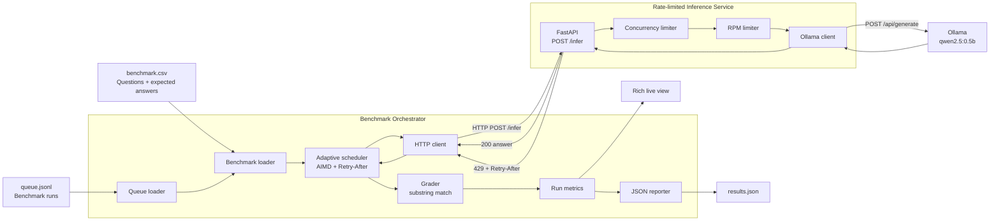
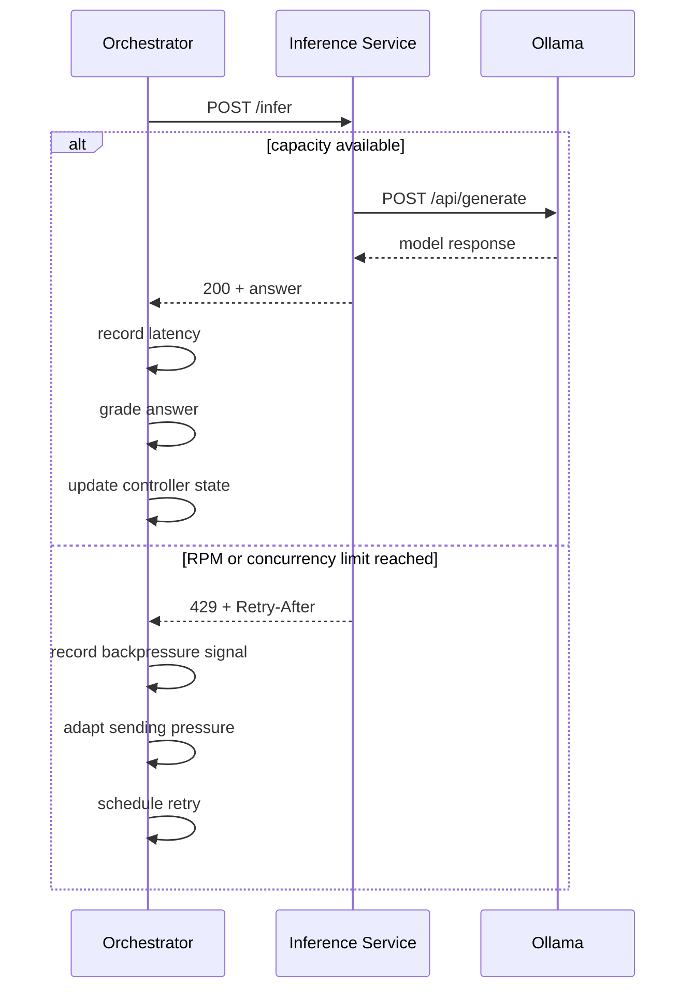
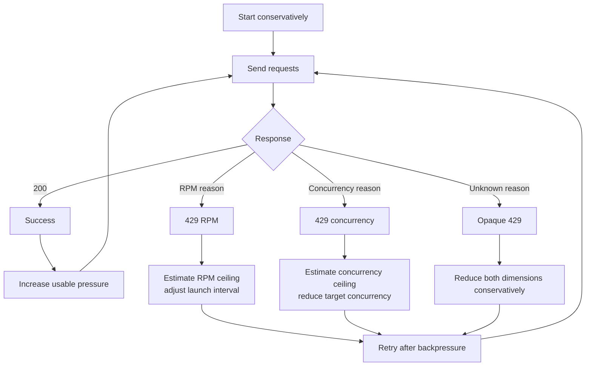

# Benchmark Orchestrator

An end-to-end system for pushing benchmark workloads through a capacity-constrained local inference endpoint as quickly, reliably, and observably as possible.

The project contains two independent processes:

1. **Inference service** — a FastAPI wrapper around a local Ollama model that enforces configurable RPM and in-flight concurrency limits.
2. **Benchmark orchestrator** — an adaptive runner that loads benchmark jobs, dispatches requests, reacts to `429` backpressure, retries safely, grades responses, displays live execution state, and writes a structured report.

The orchestrator does **not** read the configured limits from the service. It discovers usable capacity from runtime feedback.

## Key result

In a controlled local benchmark of 1,000 requests against the same 60 RPM endpoint, both schedulers achieved essentially the same throughput. The adaptive scheduler, however, reached that throughput with far less backpressure and more reliable completion.

| Metric               | Fixed concurrency |          Adaptive scheduler |
| -------------------- | ----------------: | --------------------------: |
| Total wall time      |             16:37 |                       16:45 |
| Throughput           |      60.2 req/min |                59.7 req/min |
| Concurrency control  |        Fixed at 4 | Adaptive, learned limit ≈ 4 |
| Rate-limit responses |               154 |                       **3** |
| Retries              |               153 |                       **3** |
| Final failures       |                 1 |                       **0** |


The adaptive scheduler therefore maintained near-identical throughput while reducing rate-limit responses and retries by approximately **98%**, and completed the full workload without final failures.


---

## Quickstart

### 1. Install dependencies

```bash
uv sync
```

### 2. Pull the Ollama model

```bash
ollama pull qwen2.5:0.5b
```

### 3. Start the inference service

```bash
make serve
```

Equivalent command:

```bash
uv run inference-service \
  --model qwen2.5:0.5b \
  --rpm 60 \
  --max-concurrency 4 \
  --port 8000
```

### 4. Run the benchmark orchestrator

In another terminal:

```bash
make benchmark
```

Equivalent command:

```bash
uv run benchmark-orchestrator \
  --queue data/queue.jsonl \
  --endpoint http://localhost:8000/infer \
  --out results/run.json
```

The repository includes a sample `benchmark.csv` and `queue.jsonl`.

---

## Architecture



The inference service intentionally behaves like a constrained production endpoint. It never queues excess work internally: a request is either admitted immediately or rejected with explicit backpressure.

The orchestrator owns the workload queue and decides when to launch requests, how many to keep active, how to react to `429` responses, when to retry, and how to adapt sending pressure over time.

---

## Input format

### `benchmark.csv`

```csv
id,question,expected_answer
1,What is the capital of France?,Paris
2,What is 12 times 8?,96
```

### `queue.jsonl`

```json
{"benchmark_id": "run_001", "csv_path": "data/benchmark.csv"}
{"benchmark_id": "run_002", "csv_path": "data/benchmark.csv"}
```

The sample workload references the same 100-question benchmark multiple times to produce 1,000 total queries.

---

## Inference service

### Functional requirements

The inference service must:

- expose `GET /health` and `POST /infer`;
- run inference through a local Ollama model;
- enforce a configurable rolling RPM limit;
- enforce a configurable maximum number of concurrent in-flight requests;
- reject excess traffic immediately with HTTP `429`;
- include a `Retry-After` header on rate-limit responses;
- never silently drop requests;
- never queue requests internally;
- release concurrency capacity on success, timeout, or downstream failure.

### Non-functional requirements

The inference service should:

- remain correct when several asynchronous requests arrive concurrently;
- use deterministic, race-safe admission logic;
- use a monotonic clock for all rate-limit timing;
- provide a strict rolling-window RPM guarantee;
- optionally expose structured rate-limit reasons for observability;
- keep admission control simple enough to inspect and test;
- behave consistently when Ollama is slow or unavailable.

### Contract

The service exposes:

- `GET /health` — lightweight health information;
- `POST /infer` — model inference.

A request is accepted only when both admission checks pass:

1. the rolling RPM limit;
2. the maximum number of concurrent in-flight requests.

If either limit is reached, the service immediately returns:

```http
429 Too Many Requests
Retry-After: <seconds>
```

No request is silently dropped and no internal queue is used.

The concurrency slot is held for the full downstream Ollama call and released in a `finally` block, including when Ollama fails or times out.

### Request flow



### RPM limiter

The default implementation uses an exact rolling 60-second window.

For every accepted request, the limiter stores a monotonic timestamp. Before evaluating a new request, it removes timestamps outside the active window. A new request is accepted only when fewer than `rpm` timestamps remain.

Properties:

- strict rolling-window enforcement;
- meaningful `Retry-After` calculation from the oldest active request;
- `O(rpm)` memory;
- amortized `O(1)` admission work;
- monotonic time, so wall-clock adjustments cannot affect admission decisions.

#### Burst behavior

A pure sliding window enforces the hard RPM limit but does not smooth traffic. An empty window may admit many requests at once and then reject subsequent requests until capacity returns.

An optional token-bucket pacing layer can smooth admissions while preserving the exact rolling-window check:

- the sliding window enforces the hard limit;
- the token bucket controls burstiness.

The service still never sleeps while admitting requests. If capacity is unavailable, it rejects immediately.

### Concurrency limiter

The concurrency limiter uses a lock-protected in-flight counter.

The check-and-increment operation is atomic:

```text
if in_flight >= limit:
    reject immediately
else:
    increment and admit
```

A semaphore is intentionally not used for waiting, because waiting would create an internal service queue, which the assignment explicitly forbids.

### Process scope

Rate-limit and concurrency state are stored in memory, so the service intentionally runs with a single Uvicorn worker.

A multi-instance production deployment would require coordinated admission control, for example through a shared Redis-backed limiter or an API gateway. That was left outside the take-home scope.

---

## Benchmark orchestrator

### Functional requirements

The orchestrator must:

- load benchmark jobs from a JSONL queue;
- load question-answer pairs from CSV benchmark files;
- dispatch all questions to the inference service;
- handle HTTP `429` responses and respect `Retry-After`;
- retry transient failures within a bounded retry budget;
- adapt to endpoint capacity without reading configured service limits;
- preserve logical questions when HTTP attempts are retried;
- grade model responses;
- expose live execution progress;
- produce a structured results report.

### Non-functional requirements

The orchestrator should:

- maximize throughput without overwhelming the inference service;
- react quickly when service capacity changes;
- avoid silent request loss;
- keep retry and backpressure behavior observable;
- distinguish logical questions from HTTP attempts;
- keep metrics internally consistent through a single source of truth;
- remain usable through a simple CLI;
- avoid hard-coded assumptions about RPM or concurrency limits;
- remain extensible enough to add new scheduler strategies or benchmark job types.

The orchestrator consumes the logical workload and turns each question into one or more HTTP attempts.

A useful distinction is:

```text
logical questions != HTTP attempts
```

For example:

```text
1000 completed questions
1003 HTTP attempts
3 retries
```

This distinction is tracked explicitly in the run metrics.

### Baseline: fixed concurrency

A fixed-concurrency scheduler is kept as a simple baseline.

It runs with a configured maximum concurrency, retries transient failures, respects `Retry-After`, and applies bounded exponential backoff to non-rate-limit failures.

This version is simple and predictable, but requires the operator to choose a concurrency value in advance.

### Adaptive scheduler

The main scheduler does not assume the service capacity upfront.

It adapts two independent controls:

- **target concurrency** — the desired upper bound on active request attempts;
- **launch interval** — the minimum delay between starting two HTTP requests.

Successful requests indicate available capacity. `429` responses indicate that one of the service boundaries has been crossed.

When the service exposes a structured reason:

- `rpm_limited` → adapt launch pacing;
- `concurrency_limited` → adapt target concurrency.

When reasons are hidden, the same `429 + Retry-After` contract still works, but the scheduler falls back to conservative heuristics.

### Adaptive control loop



The controller follows an AIMD-inspired strategy:

- increase pressure gradually while requests succeed;
- reduce pressure after explicit backpressure;
- use `Retry-After` as the authoritative retry delay;
- requeue rate-limited work instead of counting it as a final failure;
- stop only when the retry budget is exhausted.

The configured service limits are assumed to remain stable during one benchmark run.

---

## Observability

The CLI uses two complementary observability layers.

### Live terminal view

Rich continuously displays:

- completed logical questions;
- HTTP attempts;
- overall and recent throughput;
- average, p50, and p95 latency;
- target concurrency;
- current and peak HTTP in-flight requests;
- launch RPM and launch interval;
- estimated RPM and concurrency ceilings;
- retries;
- `429` counts by type;
- accuracy;
- ETA.

### Event logs

The live view owns continuous progress. Logs are reserved for state transitions and exceptional events.

| Event | Level |
|---|---|
| `RUN_STARTED` | `INFO` |
| `CONTROL_UPDATE` | `INFO` |
| `BACKPRESSURE_PAUSE` | `INFO` |
| `RATE_LIMIT` | `WARNING` |
| `HTTP_DISPATCH` | `DEBUG` |
| `RETRY_SCHEDULED` | `DEBUG` |
| `REQUEST_FAILED` | `ERROR` |
| `RUN_FINISHED` | `INFO` |

Both Rich and the Python logger share the same console so event logs remain readable while the live view is active.

### Single source of truth

```text
                    ┌─────────────────┐
                    │   RunMetrics    │
                    │ single source   │
                    │    of truth     │
                    └────────┬────────┘
                             │
                ┌────────────┼─────────────┐
                │            │             │
                ▼            ▼             ▼
           Scheduler    Rich dashboard   Final report
```

The scheduler, terminal view, and final report all read from the same metrics object. This avoids duplicated counters drifting apart.

In production, the same stable events could be emitted as structured JSON logs, for example through `structlog`, and sent to an observability backend.

---

## Example run

One local run used:

```text
Service RPM limit:          120
Service concurrency limit:    8
Questions:                  1000
```

Observed summary:

```text
Total wall time              08:40
Completed                1000 / 1000
Failures                          0
HTTP attempts                   1003
Retries                            3
Throughput                115.4 req/min
Average latency                1235 ms
p50 latency                     440 ms
p95 latency                    4119 ms
Estimated RPM ceiling             120
Estimated concurrency ceiling       8
Rate limits          3 (RPM 2, concurrency 1)
Peak HTTP in-flight                9
```

The run sustained roughly 96% of the observed RPM ceiling over the full wall-clock duration, including initial probing and backpressure pauses.

---

## Output

The orchestrator writes a structured JSON results file containing at least:

- total wall time;
- per-benchmark wall time;
- total requests;
- failure count;
- retry count;
- HTTP `429` count;
- throughput;
- p50 and p95 request latency;
- overall accuracy.

Example:

```json
{
  "total_wall_time_sec": 520.0,
  "total_requests": 1000,
  "successful_requests": 1000,
  "failure_count": 0,
  "retry_count": 3,
  "http_429_count": 3,
  "throughput_req_s": 1.92,
  "latency_ms": {
    "p50": 440,
    "p95": 4119
  },
  "accuracy": 0.598
}
```

---

## Grading

Answer grading is intentionally simple.

A response is marked correct when the expected answer appears as a case-insensitive substring of the model output.

This keeps the focus on orchestration, backpressure, and reliability rather than NLP evaluation quality.

---

## Tradeoffs

This implementation favors a working, observable end-to-end system over a heavier distributed architecture.

Current tradeoffs:

- in-memory queue;
- no persistent checkpoint/resume mechanism;
- simple substring-based grading;
- no distributed workers;
- no authentication;
- no Prometheus/Grafana integration;
- single-process rate-limit state;
- Docker is not the default execution path, to keep local Ollama setup simple.

---

## What I would build next

With more time, I would add:

- checkpointing and resume for long benchmark runs;
- priority queues for mixed workloads;
- richer benchmark job types;
- Prometheus metrics and structured JSON logs;
- distributed workers with shared state;
- more advanced adaptive control for opaque `429` signals;
- reproducible load-test scenarios;
- optional Docker Compose support.

---

## AI usage

AI tooling was used to accelerate boilerplate generation, review edge cases, compare alternative rate-control strategies, and improve documentation.

The system design, tradeoff decisions, controller behavior, load-testing results, and final implementation were manually reviewed and tested end to end.