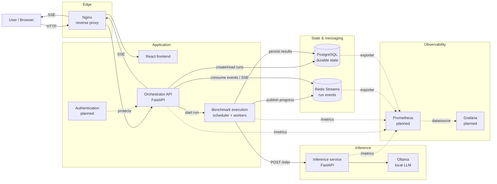
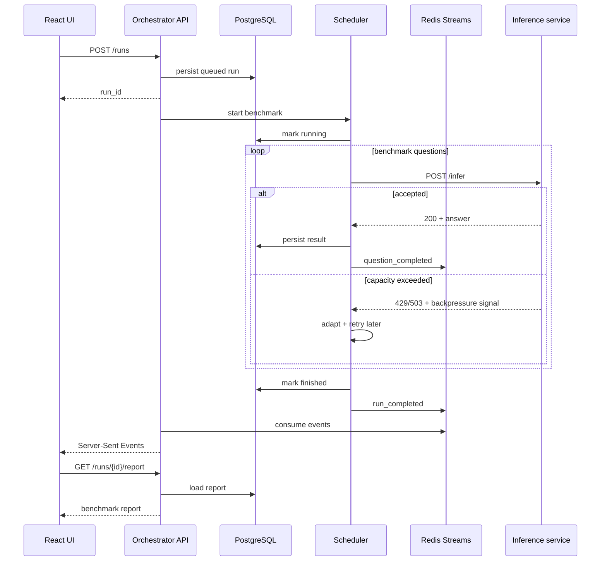

# Benchmark Orchestrator

A distributed benchmark execution platform for running large evaluation workloads against capacity-constrained inference endpoints, adapting to backpressure, tracking execution state, and exposing results through a web interface.

The project started as a CLI benchmark runner and evolved into a service-oriented system with persistent runs, asynchronous execution, event streaming, and a dedicated frontend.

The central problem is simple:

> How can a client drive an inference endpoint close to its usable capacity without knowing its limits in advance, while remaining reliable and observable under rate limits, concurrency limits, retries, and failures?

The orchestrator answers that by combining adaptive scheduling, explicit backpressure handling, persistent state, event-driven progress updates, and benchmark reporting.

## What the system does

A user creates a benchmark run from the web application. The orchestrator persists the run, executes questions asynchronously against the inference service, adapts request pressure based on runtime feedback, records per-question outcomes, publishes progress events, and produces a structured report.

The inference service intentionally behaves like a constrained production API: it enforces request-per-minute and in-flight concurrency limits and rejects excess traffic instead of silently queueing it.

## Architecture

The diagram below represents the target architecture of the project. Components marked as planned are part of the intended production-style architecture but may still be under implementation.



### Request lifecycle



## Services

| Component | Responsibility | Documentation |
|---|---|---|
| Orchestrator | Run lifecycle, scheduling, retries, persistence, events, reports | [`services/orchestrator/README.md`](services/orchestrator/README.md) |
| Inference service | Controlled LLM endpoint with explicit RPM and concurrency limits | [`services/inference_service/README.md`](services/inference_service/README.md) |
| Frontend | Run creation, live progress and benchmark reports | [`services/frontend/README.md`](services/frontend/README.md) |

## Core design choices

### PostgreSQL for durable application state

PostgreSQL is the source of truth for state that must survive process restarts: runs, their status, question results, timestamps, and generated reports.

It is deliberately not replaced by Redis. Benchmark results are durable business data and benefit from relational constraints, transactions, queryability, migrations, and predictable persistence semantics.

### Redis Streams for event delivery

Redis Streams are used for transient execution events such as `question_completed` and `run_completed`.

They solve a different problem from PostgreSQL: they allow producers and consumers to communicate asynchronously without making the database the transport layer for every progress update.

Streams are a good fit here because they provide:

- ordered event logs per stream;
- consumer-friendly incremental reads;
- persistence beyond a simple pub/sub message;
- low operational overhead for a project of this scale;
- a natural path toward consumer groups if execution becomes distributed.

PostgreSQL remains the durable source of truth. Redis events are used to propagate changes, not to redefine ownership of application state.

### Server-Sent Events for live progress

The browser receives run progress through SSE rather than WebSockets.

The communication pattern is primarily server-to-client: once a run has been created, the frontend needs a stream of progress updates but does not need a bidirectional socket protocol. SSE therefore keeps the transport simpler while providing automatic browser reconnection semantics and working naturally over HTTP.

### Nginx as the edge layer

Nginx provides a single entry point in front of the frontend and API.

Its role is intentionally infrastructural rather than application-specific:

- route `/api/*` traffic to FastAPI;
- serve or proxy the frontend;
- terminate TLS in a deployed environment;
- centralize headers and request limits;
- proxy long-lived SSE connections correctly;
- avoid exposing each internal service directly to clients.

This also means authentication, TLS and routing can evolve without coupling those concerns to the React application or benchmark scheduler.

### Separate inference service

The inference service is isolated from the orchestrator because it represents the system under load rather than the load generator itself.

It owns admission control and model access. The orchestrator owns scheduling and adaptation. Keeping those responsibilities separate makes it possible to test scheduling behavior against a clear external contract and later replace the local service with a remote inference provider.

### Adaptive scheduling

The orchestrator does not read the inference service's configured limits. It learns usable capacity from observed responses.

The adaptive scheduler controls two related but distinct dimensions:

- **target concurrency** — how many requests may be active simultaneously;
- **launch pacing** — how quickly new attempts are started.

This distinction matters because an RPM limit and a concurrency limit are different bottlenecks. Increasing concurrency cannot solve an RPM bottleneck, and slowing request launches does not necessarily solve saturation caused by long-running concurrent requests.

## Authentication

Authentication is the next application-level concern planned for the platform.

The intended boundary is the orchestrator API, behind Nginx. The browser authenticates once and sends credentials with API requests; run ownership and authorization checks remain server-side.

A production-oriented version should support:

- authenticated API access;
- ownership of benchmark runs;
- authorization on run, event and report endpoints;
- secure password or external identity-provider flows;
- short-lived access credentials and appropriate refresh/session handling;
- no authentication logic inside the scheduler or inference domain code.

The exact authentication provider and token/session strategy should remain replaceable behind an application-level identity abstraction.

## Observability

The project currently exposes execution state through application events and the frontend. The target observability stack adds Prometheus and Grafana.

Prometheus should collect operational metrics such as:

- HTTP request count and latency;
- benchmark throughput;
- p50/p95/p99 inference latency;
- active and target concurrency;
- retry counts;
- `429` and `503` rates;
- Redis stream lag;
- database connection-pool usage;
- run failure rate.

Grafana then provides dashboards for both service health and scheduler behavior. This is intentionally separate from benchmark reports: a report describes one benchmark run, whereas Prometheus/Grafana describe the health and behavior of the running platform.

## Benchmark result

An earlier controlled local experiment compared fixed and adaptive scheduling against the same inference endpoint configured for 60 RPM and a maximum concurrency of 4.

| Metric | Fixed concurrency | Adaptive scheduler |
|---|---:|---:|
| Total wall time | 16:37 | 16:45 |
| Throughput | 60.2 req/min | 59.7 req/min |
| Concurrency control | Fixed at 4 | Learned ≈ 4 |
| Rate-limit responses | 154 | **3** |
| Retries | 153 | **3** |
| Final failures | 1 | **0** |

The adaptive scheduler maintained essentially identical throughput while reducing rate-limit responses and retries by about 98%.

A later 1,000-question run against a 120 RPM / concurrency-8 service completed all questions with 3 retries and sustained approximately 115 requests/minute over the complete wall-clock duration.

## Repository layout

```text
.
├── README.md
├── docker-compose.yml
├── services/
│   ├── orchestrator/
│   │   └── README.md
│   ├── inference_service/
│   │   └── README.md
│   └── frontend/
│       └── README.md
└── ...
```

The exact internal package structure is documented by each service rather than duplicated here.

## Local development

The preferred development workflow is Docker Compose for infrastructure and service integration, while individual services can still be run directly during focused development.

Typical full-stack startup:

```bash
docker compose up --build
```

The concrete ports, environment variables and service-specific commands are documented in the corresponding service README files.

## Current status

The project is intentionally evolving from a take-home-style benchmark runner toward a production-inspired service architecture.

Implemented or already represented in the codebase:

- fixed and adaptive schedulers;
- explicit handling of inference backpressure;
- FastAPI orchestrator API;
- asynchronous benchmark execution;
- PostgreSQL persistence;
- Redis-backed execution events;
- SSE progress updates;
- React frontend;
- persisted benchmark reports;
- Docker-based local environment.

Planned / being integrated:

- authentication and authorization;
- Nginx edge routing for the complete stack;
- Prometheus metrics;
- Grafana dashboards;
- stronger worker isolation and recovery semantics;
- distributed execution if required by scale.

## Engineering principles

The implementation follows a few deliberate rules:

1. **Explicit backpressure over hidden queues.** Capacity violations should be observable and actionable.
2. **Durable state and transport are separate concerns.** PostgreSQL stores truth; Redis distributes events.
3. **Logical questions are not HTTP attempts.** Retries must not corrupt benchmark-level metrics.
4. **Infrastructure concerns stay at the edges.** Nginx, authentication and telemetry should not leak into scheduling logic.
5. **Simple protocols first.** HTTP and SSE are used where they solve the problem without unnecessary coordination complexity.
6. **Measure before distributing.** The architecture can evolve toward more workers, but only where scale or reliability actually requires it.

## Further documentation

- [Orchestrator](services/orchestrator/README.md)
- [Inference service](services/inference_service/README.md)
- [Frontend](services/frontend/README.md)
