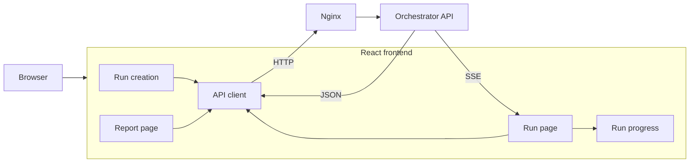

# Frontend

The frontend is the user-facing interface for the benchmark orchestration platform.

It is a React application responsible for creating benchmark runs, displaying live execution progress, and presenting the final benchmark report. It does not own benchmark state; PostgreSQL-backed orchestrator APIs remain the source of truth.

## Responsibilities

The frontend provides:

- benchmark run creation;
- navigation to individual run pages;
- live execution progress;
- terminal-state handling (`finished` / `failed`);
- links from completed runs to reports;
- aggregate and per-benchmark report visualization;
- client-side error and loading states.

## Architecture



## Main pages

### Run page

The run page loads the persisted state once through the REST API and then subscribes to live updates through `EventSource`.

The initial REST request is important even when SSE is available: SSE is an update channel, not the durable source of truth.

Conceptually:

```text
GET /runs/{run_id}
        |
        v
initial Run state
        |
        +---- EventSource /runs/{run_id}/events
                         |
                         v
                  incremental updates
```

When the run reaches `finished`, the UI exposes the report link.

### Report page

The report page consumes:

```text
GET /runs/{run_id}/report
```

and presents three levels of information:

1. overall benchmark KPIs;
2. latency/performance metrics;
3. per-benchmark metrics.

A typical report includes:

- accuracy;
- successful / failed request counts;
- throughput;
- wall time;
- p50/p95/min/max latency;
- per-benchmark accuracy and latency.

The API response is expected to match the TypeScript contract directly rather than expose persistence-layer wrappers.

Example type:

```ts
export type LatencyMetrics = {
    p50: number | null
    p95: number | null
    min: number | null
    max: number | null
}

export type Metrics = {
    total_requests: number
    successful_requests: number
    failure_count: number
    accuracy: number
    latency_ms: LatencyMetrics
}

export type BenchmarkMetrics = {
    benchmark_id: string
    metrics: Metrics
}

export type ReportSummary = Metrics & {
    total_wall_time_sec: number
    throughput_req_s: number
    benchmarks: BenchmarkMetrics[]
}

export type BenchmarkReport = {
    generated_at: string
    summary: ReportSummary
}
```

## Why SSE instead of WebSockets?

Benchmark progress is fundamentally one-directional after the run has been created:

```text
server -> browser
```

The browser does not need to continuously send messages over the same connection. SSE therefore provides the required behavior with less protocol and application complexity.

Advantages include:

- native browser `EventSource` support;
- normal HTTP semantics;
- straightforward reconnection behavior;
- simple integration with FastAPI streaming responses;
- easier infrastructure than a bidirectional socket protocol.

WebSockets would make more sense if the UI later required interactive bidirectional control such as pausing runs, live parameter tuning, collaborative sessions or high-frequency client messages.

## REST + events

The frontend deliberately combines REST and SSE instead of treating the event stream as the only data source.

REST answers:

> What is the current durable state?

SSE answers:

> What changed after I started watching?

This distinction makes page refreshes and reconnects robust. If an event is missed, the client can always reload the current run from the API.

## Nginx integration

In the target deployment, the frontend and API are exposed through the same Nginx entry point.

A typical routing model is:

```text
/          -> frontend
/api/*     -> orchestrator API
```

This avoids hard-coding separate public service origins in the browser and simplifies:

- HTTPS;
- CORS configuration;
- authentication cookies/headers;
- deployment routing;
- SSE proxying.

SSE proxy locations must disable response buffering or otherwise be configured so events are forwarded to the browser as they are produced rather than accumulated by Nginx.

## Authentication

Authentication is planned at the API boundary.

From the frontend perspective, the important requirements are:

- authenticated API requests;
- redirect/login behavior for unauthenticated users;
- no secrets stored in application source code;
- credentials handled consistently by REST and SSE endpoints;
- authorization failures displayed distinctly from generic network failures.

One architectural caveat is that browser `EventSource` does not let application code attach arbitrary authorization headers in the same way as `fetch`. This affects the choice between cookie-based sessions, same-origin authentication, token transport, or a different SSE client strategy. It should be decided before authentication is finalized.

## UI design principles

The UI should remain closer to an engineering dashboard than to a consumer application.

Recommended principles:

- surface run state immediately;
- prioritize a small set of meaningful KPIs;
- separate benchmark results from platform telemetry;
- use tables for per-benchmark comparison;
- add charts only when time-series data is available;
- keep run IDs visible but visually secondary;
- make failures and backpressure understandable rather than merely red.

A report page should not graph values just because a chart is possible. Static metrics such as p50/p95 are generally clearer as cards or tables; charts become valuable for throughput, concurrency, latency and rate-limit behavior over time.

## Error handling

Frontend error states should distinguish at least:

- `404` — run does not exist;
- `409` — report requested before the run has completed;
- authentication/authorization errors once auth is enabled;
- backend unavailable;
- malformed or unexpected API payloads.

TypeScript types provide compile-time guarantees only. They do not validate JSON received at runtime. If the API contract becomes less controlled, runtime validation with a schema library such as Zod is a reasonable future addition.

## Development

The frontend is designed to run independently during UI development and as part of the full Docker Compose stack for integration testing.

Typical local workflow:

```bash
npm install
npm run dev
```

When using Vite, the development server can proxy API traffic to the orchestrator so frontend code can use relative `/api/...` URLs rather than hard-coded localhost origins.

A production build is typically generated with:

```bash
npm run build
```

and can be served as static assets through Nginx.

## Future improvements

Likely frontend additions include:

- authentication screens and protected routes;
- run history and filtering;
- richer failure diagnostics;
- scheduler configuration controls;
- time-series charts for throughput, latency and concurrency;
- comparison of multiple benchmark runs;
- links from Grafana/platform telemetry back to run IDs where useful.
