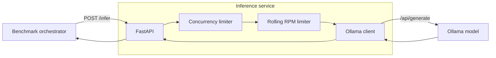

# Inference Service

The inference service is a deliberately constrained FastAPI wrapper around a local Ollama model.

Its purpose is not only to expose LLM inference. It also emulates the behavior of a production inference endpoint with finite request-rate and concurrency capacity so the orchestrator can be tested against realistic backpressure.

## Responsibilities

The service:

- exposes a lightweight health endpoint;
- exposes model inference over HTTP;
- forwards accepted requests to Ollama;
- enforces a configurable rolling requests-per-minute limit;
- enforces a configurable maximum number of in-flight requests;
- rejects excess traffic explicitly;
- releases capacity correctly on success, timeout or downstream failure.

## Architecture



## HTTP contract

Representative endpoints:

```text
GET  /health
POST /infer
```

A request is accepted only when both admission checks pass:

1. rolling RPM capacity is available;
2. an in-flight concurrency slot is available.

Otherwise the request is rejected immediately with an explicit backpressure response such as `429 Too Many Requests` or, depending on the current service contract, a concurrency-specific `503` response.

Where appropriate the response includes `Retry-After` or a structured reason that the orchestrator can use to adapt.

## Why reject instead of queue?

The service intentionally does not hide overload behind an internal request queue.

If the inference service queued every request, the orchestrator could continue increasing load while observing only growing latency. That would hide the actual service capacity boundary and make adaptive scheduling much harder to evaluate.

Explicit rejection provides a clean control signal:

```text
capacity available -> admit
capacity exhausted -> reject immediately
```

The orchestrator then owns when and how to retry.

## Rolling RPM limiter

The rate limiter uses a rolling time window rather than a fixed calendar window.

For every accepted request, it records a monotonic timestamp. Before evaluating another request, expired timestamps are removed. A request is admitted only when the number of active timestamps is below the configured RPM limit.

This provides:

- strict enforcement over any rolling 60-second interval;
- meaningful `Retry-After` calculation;
- monotonic timing immune to system wall-clock adjustments;
- memory proportional to the configured RPM limit;
- amortized constant-time queue operations.

Conceptually:

```text
now = monotonic_time()
remove timestamps older than now - 60s

if accepted_requests_in_window >= rpm_limit:
    reject
else:
    record now
    accept
```

## Concurrency limiter

Concurrency is tracked separately from RPM.

The limiter performs an atomic check-and-increment around the number of currently admitted inference calls:

```text
if in_flight >= max_concurrency:
    reject immediately
else:
    in_flight += 1
    execute inference
    finally:
        in_flight -= 1
```

A waiting semaphore is intentionally not used as the primary admission behavior because waiting would create a hidden queue inside the service.

The slot must be released in a `finally` path so downstream timeouts and exceptions cannot leak capacity.

## Why rate and concurrency are separate

They represent different resource constraints.

An endpoint can be:

- RPM-limited even with very low concurrency;
- concurrency-limited because requests are slow;
- constrained by both simultaneously.

The distinction allows the adaptive orchestrator to react differently to launch-rate saturation and in-flight saturation.

## Ollama

The service delegates actual model execution to a local Ollama server.

The original development configuration used:

```text
qwen2.5:0.5b
```

The model is intentionally small enough to support repeatable local load experiments. The service boundary means Ollama can later be replaced by another inference backend without changing scheduler semantics.

## Process model

Rate-limit and concurrency state are currently held in process memory.

That makes a single service process the correct execution model for strict local experiments. Running multiple independent Uvicorn workers would create independent limit counters and therefore violate the intended global capacity limit.

A multi-instance deployment would require shared admission control, for example:

- Redis-backed counters/scripts;
- an API gateway with centralized rate limiting;
- a dedicated inference gateway.

This is intentionally separate from the current benchmark problem.

## Multi-client behavior

Limits apply globally to traffic seen by the inference service.

If two orchestrators use the same service, they compete for the same RPM and concurrency capacity. The service protects itself, but the current scheduler does not attempt to guarantee fair allocation between independent clients.

This is a useful stress case for future work because an adaptive client can no longer assume that all observed capacity changes are caused by its own traffic.

## Failure behavior

The service should remain predictable when Ollama is unavailable, slow or returns an error.

Important invariants are:

- admitted requests never disappear silently;
- concurrency capacity is always released;
- downstream timeouts are bounded;
- errors are translated into stable HTTP responses;
- admission-control state remains consistent after failure.

## Observability

Prometheus instrumentation is a natural next step for the service.

Useful metrics include:

```text
inference_http_requests_total
inference_requests_in_flight
inference_request_duration_seconds
inference_rate_limit_rejections_total
inference_concurrency_rejections_total
inference_ollama_errors_total
inference_ollama_duration_seconds
```

A Grafana dashboard can then show whether throughput is bounded by request rate, concurrent execution, model latency or downstream failures.

## Testing

The most valuable tests target admission-control invariants:

- never admit more than the configured concurrency;
- never exceed the strict rolling RPM budget;
- rejected requests are immediate rather than queued;
- capacity is released after exceptions/timeouts;
- `Retry-After` is consistent with the rolling window;
- concurrent requests cannot race through the limiter.

## Design rationale

The service is intentionally simple. It is a deterministic capacity boundary for the orchestration problem, not a general-purpose LLM serving platform.

That simplicity makes scheduler experiments interpretable: when the orchestrator receives backpressure, the source of that signal is controlled and testable.
