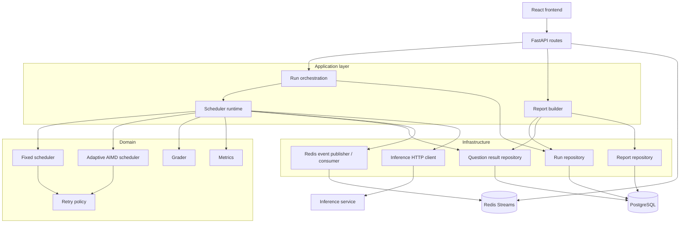
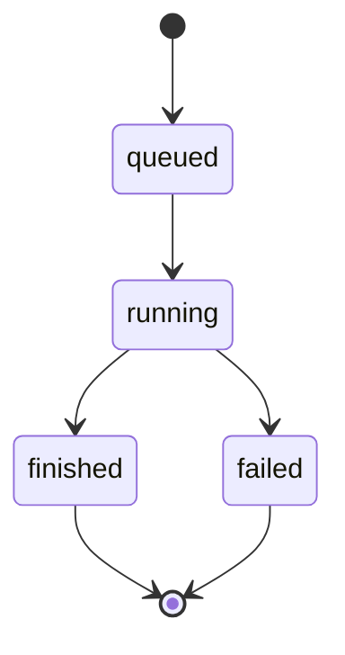
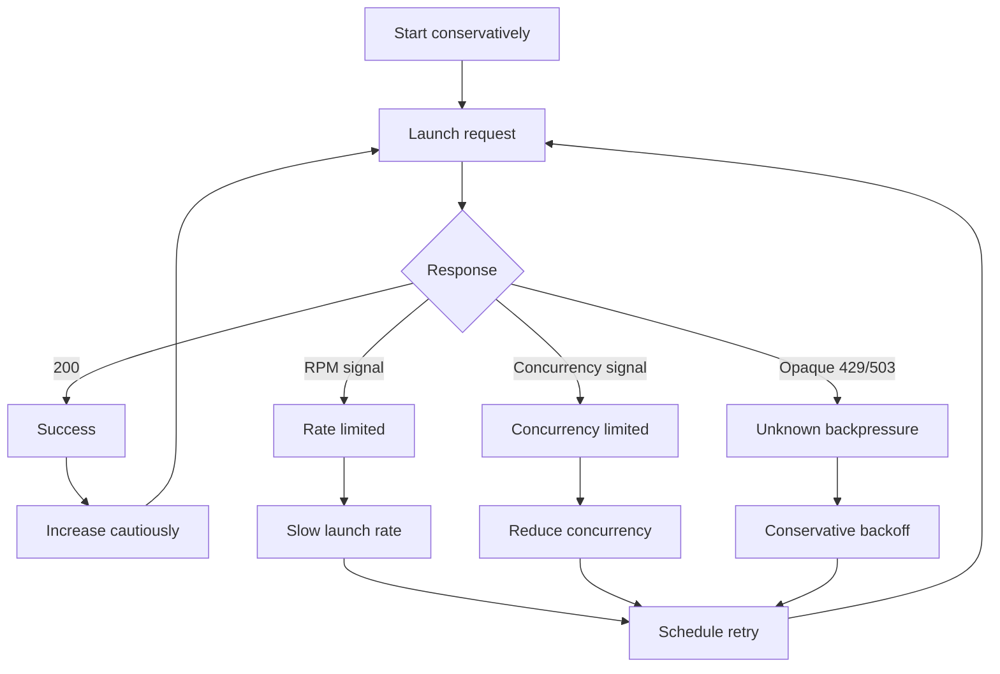

# Orchestrator Service

The orchestrator is the control plane and execution engine of the benchmark platform.

It owns benchmark run lifecycle, scheduling, retries, persistence, progress events, grading, metrics, and report generation. It deliberately does **not** own model inference or inference admission control; those belong to the inference service.

## Responsibilities

The service is responsible for:

- creating and tracking benchmark runs;
- loading benchmark questions;
- scheduling HTTP requests against an inference endpoint;
- respecting backpressure and retry signals;
- adapting request pressure when the endpoint capacity is unknown;
- grading model responses;
- persisting run and question state in PostgreSQL;
- publishing execution events to Redis Streams;
- exposing run state and live progress through FastAPI;
- generating and serving benchmark reports.

## Internal architecture



The dependency direction should remain roughly:

```text
interfaces -> application -> domain
                    |
                    v
              infrastructure
```

Domain scheduling and metrics code should not import FastAPI schemas or SQLAlchemy models. Adapters convert persistence or API objects into the small domain structures required by the scheduler and metrics engine.

## Run lifecycle

A typical run moves through:

```text
queued -> running -> finished
                  \
                   -> failed
```

The API creates the durable run record before benchmark execution begins. Execution can therefore be decoupled from the lifecycle of the HTTP request that created it.

A simplified flow is:



## API

The current API is centered around benchmark runs.

Representative endpoints:

```text
POST /runs/
GET  /runs/{run_id}
GET  /runs/{run_id}/events
GET  /runs/{run_id}/report
```

`POST /runs/` returns a run identifier without waiting for the benchmark to complete.

`GET /runs/{run_id}/events` exposes progress as a Server-Sent Events stream.

`GET /runs/{run_id}/report` serves the persisted report once the run is complete. Report generation can be triggered at run completion or lazily as a fallback, but the persisted report remains the API-facing artifact.

## Persistence

PostgreSQL is the durable source of truth.

The service stores at least:

- run identity and status;
- total/completed question counts;
- start and finish timestamps;
- per-question results;
- generated benchmark reports.

SQLAlchemy's async API is used for database access and Alembic manages schema migrations.

Repositories hide SQLAlchemy query mechanics from the application layer. For example, repository `get()` methods return models or domain values rather than raw `Result`/`ChunkedIteratorResult` objects.

### Why PostgreSQL?

Benchmark state is durable relational data rather than ephemeral coordination data. PostgreSQL provides:

- transactional writes;
- unique and foreign-key constraints;
- predictable recovery after restart;
- efficient reporting queries;
- migrations through Alembic;
- JSONB where structured report payloads are appropriate.

## Redis Streams

Redis Streams carry execution events between producers and consumers.

Typical events include:

```text
question_completed
run_completed
run_failed
```

A scheduler can publish an event after durable state has been updated, and API-side consumers can translate those events into SSE messages for connected browsers.

### Why Streams instead of Redis Pub/Sub?

Pub/Sub is fire-and-forget: disconnected consumers lose messages. Streams retain entries and provide IDs, incremental consumption and a path toward consumer groups.

For benchmark execution this is useful because events are operationally important even though PostgreSQL remains the source of truth.

### Why not RabbitMQ?

RabbitMQ would also be a valid broker, especially if the platform evolved toward a larger distributed worker fleet with sophisticated acknowledgement, routing and delivery semantics.

Redis is currently sufficient because the project already benefits from Redis for lightweight event coordination, the event model is simple, and Streams provide persistence and consumer-group semantics without introducing another infrastructure component.

The choice is pragmatic rather than ideological: if job distribution becomes the dominant problem, RabbitMQ, Kafka or a workflow engine could become a better fit.

## Server-Sent Events

The event endpoint translates backend progress into a browser-friendly stream.

Example event shape:

```json
{
  "type": "question_completed",
  "run_id": "...",
  "status": "running",
  "completed": 418,
  "total": 1000
}
```

SSE is preferred to WebSockets because updates are almost entirely one-directional. The client creates a run through normal HTTP and then listens for server-generated progress.

## Scheduler model

A critical distinction is maintained throughout the scheduler:

```text
logical questions != HTTP attempts
```

One logical question can require several HTTP attempts due to rate limits, transient failures or retries. Benchmark metrics must therefore distinguish completed questions from request attempts.

## Fixed-concurrency scheduler

The fixed scheduler is the baseline implementation.

It:

- caps active attempts at a configured concurrency;
- retries transient failures;
- respects `Retry-After` where available;
- uses bounded retry behavior;
- provides predictable behavior when capacity is already known.

Its weakness is configuration: the operator must pick a good concurrency value in advance.

## Adaptive AIMD scheduler

The adaptive scheduler attempts to discover useful service capacity from runtime feedback.

It controls two independent values:

- **target concurrency** — upper bound on active attempts;
- **launch interval** — pacing between new requests.

Successful responses provide evidence that more pressure may be possible. Explicit rate-limit or concurrency-limit responses cause the corresponding control dimension to back off.



This separation is important: an RPM bottleneck is not equivalent to an in-flight concurrency bottleneck.

## Retry strategy

Retries are bounded and explicit.

`Retry-After` is preferred for capacity-related responses. Other transient failures can use exponential backoff with jitter to avoid synchronized retry bursts.

A request exhausting its retry budget becomes a final failed logical result; it is not silently dropped.

## Grading

The current benchmark grader intentionally remains simple. The original implementation uses case-insensitive substring matching between expected answer and generated output.

The focus of this project is orchestration, backpressure and reliability rather than evaluation methodology. The grader is therefore designed to remain replaceable.

## Metrics and reports

The reporting pipeline converts persisted question results into metric-specific domain objects before computing aggregate statistics.

Conceptually:

```text
QuestionResultModel
        |
        v
MetricResult
        |
        +--> compute_metrics()
        |
        +--> compute_per_benchmark_metrics()
        |
        v
BenchmarkReport
```

This avoids coupling domain metrics to API schemas or SQLAlchemy models.

The report currently exposes metrics such as:

- total requests/questions;
- successful and failed questions;
- accuracy;
- p50 and p95 latency;
- min/max latency;
- wall time;
- throughput;
- per-benchmark aggregates.

Example shape:

```json
{
  "generated_at": "2026-08-31T12:00:00+00:00",
  "summary": {
    "total_requests": 1000,
    "successful_requests": 1000,
    "failure_count": 0,
    "accuracy": 0.82,
    "latency_ms": {
      "p50": 440,
      "p95": 4119,
      "min": 188,
      "max": 4762
    },
    "total_wall_time_sec": 520.0,
    "throughput_req_s": 1.923,
    "benchmarks": []
  }
}
```

## Observability

Application-level observability currently comes from execution events, logs, persisted state and the frontend.

The next infrastructure layer is Prometheus + Grafana.

Useful orchestrator metrics include:

```text
benchmark_runs_total
benchmark_runs_active
benchmark_questions_completed_total
benchmark_question_failures_total
benchmark_http_attempts_total
benchmark_retries_total
benchmark_rate_limits_total
benchmark_inference_latency_seconds
benchmark_scheduler_target_concurrency
benchmark_scheduler_in_flight
benchmark_scheduler_launch_interval_seconds
benchmark_run_duration_seconds
```

Histograms should be used for latency so p50/p95/p99 can be calculated in Prometheus rather than precomputed into counters.

Grafana dashboards should separate:

1. **platform health** — API errors, DB pool, Redis lag, process resources;
2. **scheduler behavior** — throughput, concurrency, backpressure, retry rates and latency distributions.

## Authentication and authorization

Authentication belongs at the API/application boundary, not inside scheduling code.

The intended model is:

```text
Browser -> Nginx -> authenticated API -> application services
```

Once authentication is introduced, persisted runs should have an owner identity and all read/write endpoints should enforce authorization.

SSE endpoints require the same authorization discipline as regular API endpoints; possession of a run UUID should not itself grant access.

## Testing

The scheduler is exercised at several levels:

- unit tests for controller behavior;
- retry and concurrency tests;
- integration scenarios for `429` and `503` responses;
- end-to-end runs against the local inference service.

The strongest scheduler tests should assert behavior, not implementation details: bounded retries, no lost logical questions, correct completion state, convergence/backoff behavior and stable metrics.

## Historical benchmark result

A controlled 1,000-question experiment against a service limited to 60 RPM and concurrency 4 produced:

| Metric | Fixed | Adaptive |
|---|---:|---:|
| Wall time | 16:37 | 16:45 |
| Throughput | 60.2 req/min | 59.7 req/min |
| Rate-limit responses | 154 | **3** |
| Retries | 153 | **3** |
| Final failures | 1 | **0** |

The adaptive scheduler therefore achieved effectively the same service throughput while avoiding almost all unnecessary backpressure.

A later run against 120 RPM / concurrency 8 completed 1,000 / 1,000 questions with 3 retries and approximately 115.4 requests/minute overall throughput.

## Design tradeoffs

The current design intentionally avoids some heavier distributed-system machinery.

- `asyncio` tasks provide asynchronous execution within the orchestrator process; they are not a durable worker system.
- Redis Streams provide event transport but do not replace PostgreSQL persistence.
- SSE is simpler than WebSockets for one-way progress.
- The grader is intentionally basic.
- The current architecture is designed to support distributed workers later, but does not introduce them before they are necessary.

Potential future evolutions include a durable workflow engine such as Temporal/Restate, a dedicated broker for worker queues, distributed scheduler workers, checkpointing/resume, richer evaluation strategies and dynamic service discovery.
